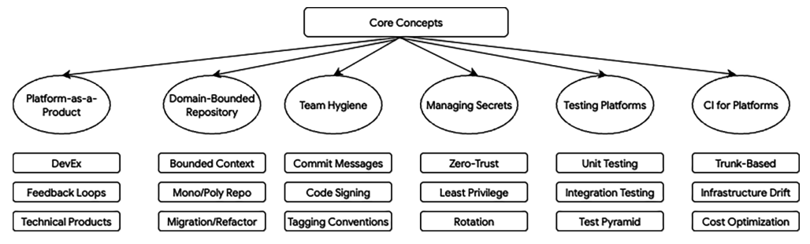
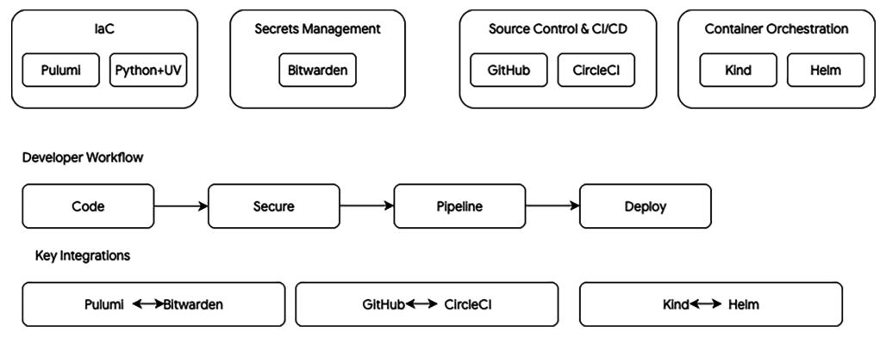

# Platform Engineering — Internal Developer Platform

Infrastructure and tooling for the **Internal Developer Platform (IDP)** — a self-service layer that lets engineering teams provision, configure, and operate platform resources consistently and securely.

## Core Concepts



*Figure 1: Core concepts — platform-as-a-product, domain-bounded repositories, team hygiene, secrets management, testing platforms, and CI for platforms.*

This repository is managed by the platform engineering team and uses **Infrastructure as Code (IaC)** to define shared services, secrets, and CI/CD foundations.

## Tooling



*Figure 2: Tools landscape — the IDP stack (Pulumi, Bitwarden, GitHub, CircleCI, Helm) and the developer workflow from code to deploy.*

--- 

### **NOTE: The focus here is on the Workflow and Lifecycle, not the specific implementation technology/tooling**

---

| Tool                                                    | Role                                                                | Docs                                                      |
| ------------------------------------------------------- | ------------------------------------------------------------------- | --------------------------------------------------------- |
| [Pulumi](https://www.pulumi.com/)                       | Infrastructure as Code — define and deploy cloud & SaaS resources   | [pulumi.com/docs](https://www.pulumi.com/docs/)           |
| [Python](https://www.python.org/)                       | Pulumi runtime language for IaC programs                            | [python.org/docs](https://docs.python.org/3/)             |
| [uv](https://docs.astral.sh/uv/)                        | Python package manager and toolchain (used by Pulumi projects)      | [docs.astral.sh/uv](https://docs.astral.sh/uv/)           |
| [Bitwarden CLI](https://bitwarden.com/help/cli/) (`bw`) | Secrets vault — store and sync credentials used by platform tooling | [bitwarden.com/help/cli](https://bitwarden.com/help/cli/) |
| [CircleCI](https://circleci.com/)                       | Continuous integration and delivery                                 | [circleci.com/docs](https://circleci.com/docs/)           |
| [GitHub](https://github.com/)                           | Source control and API targets for IaC-managed resources            | [docs.github.com](https://docs.github.com/)               |


## Documentation

Guides live in the [docs/](docs/) folder, split into **command references** (tooling cheat sheets) and **runbooks** (end-to-end operational workflows).

### Command references

Quick lookups for CLI commands and one-off setup tasks.

| Guide | Description |
| ----- | ----------- |
| [docs/pulumi.md](docs/pulumi.md) | Pulumi CLI — install, login, preview, deploy |
| [docs/bitwarden.md](docs/bitwarden.md) | Bitwarden CLI — version checks and secret injection scripts |
| [docs/github.md](docs/github.md) | GitHub PAT — fine-grained token setup for org IaC |
| [docs/circleci.md](docs/circleci.md) | CircleCI CLI — install, config validation, local setup |

### Runbooks

Step-by-step procedures for repeatable platform operations. Each runbook covers prerequisites, commands, verification, and troubleshooting — intended for engineers performing the task for the first time or infrequently.

| Runbook | Description |
| ------- | ----------- |
| [docs/add-github-repository.md](docs/add-github-repository.md) | Provision a new organisation repository via YAML, PR, CircleCI preview, and tag release |

## Repository structure

The repository is structured to facilitate clear separation of concerns across platform engineering, infrastructure as code, secret management, and automation. The main directories and files are as follows:

```
platform-team-admin/
├── README.md                    # Overview, usage, and setup instructions (this file)
├── images/                      # Diagrams and core concept illustrations
├── docs/                        # Documentation — command references and runbooks
│   ├── pulumi.md                # Command reference: Pulumi CLI
│   ├── bitwarden.md             # Command reference: Bitwarden CLI
│   ├── github.md                # Command reference: GitHub PAT setup
│   ├── circleci.md              # Command reference: CircleCI CLI
│   └── add-github-repository.md # Runbook: provision a new GitHub org repository
├── __main__.py                  # Entry point for Pulumi IaC programme (Python)
├── Pulumi.yaml                  # Pulumi project definition (name, runtime, backend)
├── config/
│   └── platform_team_values.yaml # Repository and membership configuration values
├── pulumi_repo_create.py        # Python automation: GitHub repo and membership provisioning
├── .git-hooks/                  # Version-controlled Git hook templates (commit-msg)
├── scripts/
│   └── install-githooks.sh      # Installs hooks from .git-hooks/ into .git/hooks/
├── secrets-setup/               # Bitwarden secrets management for tooling integration
│   ├── inject_secrets.sh        # Script to sync local JSON secrets into Bitwarden
│   ├── github_secrets.json_example   # Template: GitHub API credentials & org secrets
│   └── pulumi_secrets.json_example   # Template: Pulumi API credentials & config
├── .env_example                 # Example: Bitwarden CLI API credentials (.env, not committed)
└── .gitignore                   # Ignores secrets, venv, cached files, etc.
```

**Notes:**

- All automation scripts assume configuration via environment files or Bitwarden secrets vault items.
- See each `docs/*.md` for detailed, workflow-specific instructions.
- All secrets templates are examples only—**never commit real credentials**.
- Central IaC logic lives in `__main__.py` and related `.py` helpers.

---

## Getting started

### Prerequisites

- [Pulumi CLI](https://www.pulumi.com/docs/install/) ≥ 3.244
- [Python](https://www.python.org/downloads/) ≥ 3.14
- [uv](https://docs.astral.sh/uv/getting-started/installation/)
- [Bitwarden CLI](https://bitwarden.com/help/cli/) — `npm install -g @bitwarden/cli`
- [jq](https://jqlang.org/) — JSON processing for secret scripts

### 1. Install Git hooks

Git hooks are scripts that run automatically at certain points in the Git workflow (for example, when you create a commit). This repository ships a **commit-msg** hook that enforces the [Conventional Commits](https://www.conventionalcommits.org/) format — keeping commit history consistent for changelogs, release notes, and CI/CD automation.

**Format:** `type(scope)?: description`

**Allowed types:** `build`, `chore`, `ci`, `docs`, `feat`, `fix`, `perf`, `refactor`, `revert`, `style`, `test`

**Examples:**

```
feat: add initial platform-team-admin IDP foundations
docs(readme): add Git hooks installation instructions
fix(pulumi): correct organisation membership YAML key
```

Hook templates live in `.git-hooks/` (committed to the repo). They must be installed locally into `.git/hooks/` — Git does not run hooks from `.git-hooks/` automatically. Run the installer once per clone:

```bash
chmod +x scripts/install-githooks.sh
./scripts/install-githooks.sh
```

### 2. Configure local secrets

```bash
cp .env_example .env
# Edit .env with your Bitwarden API credentials (KEY=value pairs only)
```

### 3. Load secrets into Bitwarden

```bash
cd secrets-setup
cp github_secrets.json_example github_secrets.json   # fill in values
cp pulumi_secrets.json_example pulumi_secrets.json   # fill in values
chmod +x inject_secrets.sh
./inject_secrets.sh
```

See [docs/github.md](docs/github.md) for PAT setup and [docs/bitwarden.md](docs/bitwarden.md) for Bitwarden CLI usage.

### 4. Run Pulumi

```bash
pulumi login
pulumi stack select dev
pulumi preview
```

See [docs/pulumi.md](docs/pulumi.md) for the full command reference.

## Projects

### `platform-team-admin`

The first Pulumi project in this IDP. It will manage platform-team foundations — starting with GitHub organisation resources and expanding to shared services over time.

- **Stack:** `dev` (local config in `Pulumi.dev.yaml`, gitignored)
- **Runtime:** Python via uv
- **Secrets:** GitHub and Pulumi credentials stored in Bitwarden, injected via `secrets-setup/`

## Security

- Never commit `.env`, `*_secrets.json`, or `Pulumi.*.yaml` — these are listed in `.gitignore`
- Use `.env_example` and `*_example` files as templates only
- Rotate credentials if they are ever exposed outside the team vault

