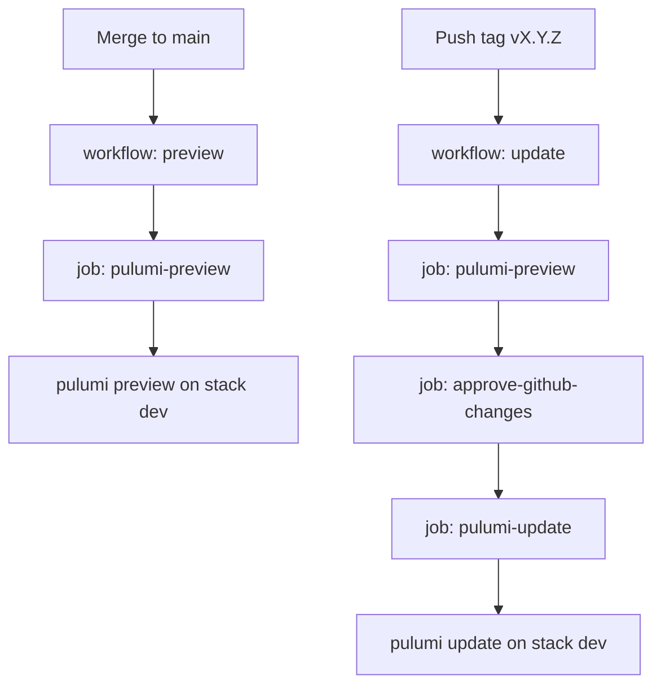

# CircleCI command reference

Pipeline config: [`.circleci/config.yml`](../.circleci/config.yml) (CircleCI 2.1, Pulumi orb `2.1.0`). Push to `main` validates; a version tag releases after manual approval.

## Cheat sheet

| Command | Purpose |
|---------|---------|
| `circleci version` | Check install and version |
| `circleci setup` | Configure with API token |
| `circleci config validate .circleci/config.yml` | Validate config |

## Pipeline overview

Two workflows, both on a **self-hosted** machine runner. Secrets come from CircleCI context **`PLATFORM_ADMIN`**.

| Workflow | When | What it does |
|----------|------|----------------|
| **preview** | Push / merge to `main` | `pulumi preview` on stack `dev` — no apply |
| **update** | Push tag `vX.Y.Z` | Preview → **Approve** in the UI → `pulumi update` |

## Local runner

Jobs use `machine: true` and `resource_class: peplatformidp/local-runner`. They run on the team’s Machine Runner, not CircleCI cloud VMs.

Jobs stay queued until that runner is **Available** in CircleCI (**Organization → Runners**). If **preview** never starts, the runner is offline.

## Triggers (`on-push-main` and `on-tag-main`)

Filters are YAML anchors reused as `filters:` on each job. CircleCI needs **both** `branches` and `tags` on a job — otherwise a tag push also runs jobs that were meant for branches only.

| Anchor | Branches | Tags | Runs on |
|--------|----------|------|---------|
| `on-push-main` | `only: main` | `ignore: /.*/` | Merge or push to `main` |
| `on-tag-main` | `ignore: /.*/` | `only:` semver `vX.Y.Z` (optional `-rc.1` suffix) | Tag `v1.2.3` or `v1.2.3-rc.1` |

Tag pattern: `/^v[0-9]+\.[0-9]+\.[0-9]+(-[a-zA-Z0-9.]+)?$/`

| Event | Workflow | Why |
|-------|----------|-----|
| PR opened or updated | **None** | Filters are `main` only, not the PR branch |
| Merge / push to `main` | **preview** | `on-push-main` |
| Tag `v0.3.0` (or `v1.0.0-rc.1`) | **update** | `on-tag-main` |
| Tag `v0.3` or `release-0.3.0` | **None** | Does not match the tag regex |

## Jobs

Both execute jobs: checkout → install `uv` → `uv sync --frozen` → `pulumi/login` → Pulumi on stack **`dev`**.

| Job | Type | Action |
|-----|------|--------|
| `pulumi-preview` | Machine | `pulumi/preview` — dry-run |
| `approve-github-changes` | `type: approval` | Human gate in the CircleCI UI. Nothing is applied until **Approve**. |
| `pulumi-update` | Machine | `pulumi/update` with `skip-preview: true` — preview already ran in the same **update** workflow |

## Workflows

**preview** (`*on-push-main`):

1. `pulumi-preview`

**update** (`*on-tag-main`):

1. `pulumi-preview`
2. `approve-github-changes` (requires preview)
3. `pulumi-update` (requires approval)

## How to follow a run

After merge, open [CircleCI pipelines](https://app.circleci.com/pipelines/github/peplatformidp/platform-team-admin) for `main` and confirm workflow **preview** / job **pulumi-preview**.

Cutting a tag and approving **update** is in [git.md — Release automation](git.md#5-release-automation-push-vs-tag).
